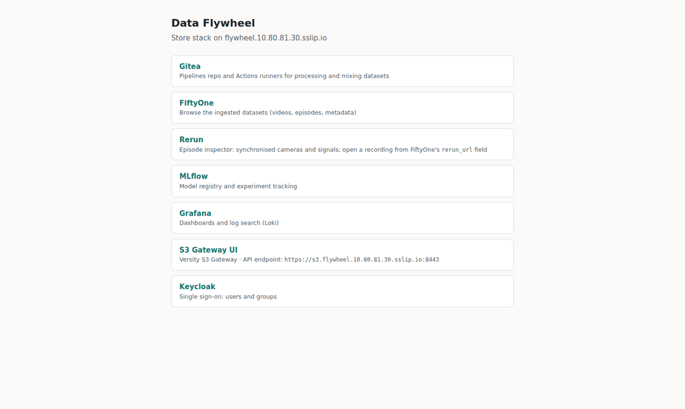
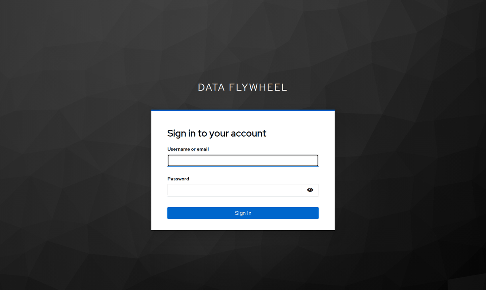
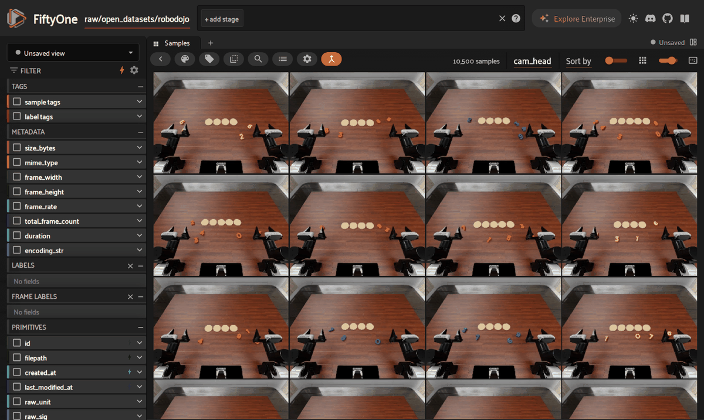
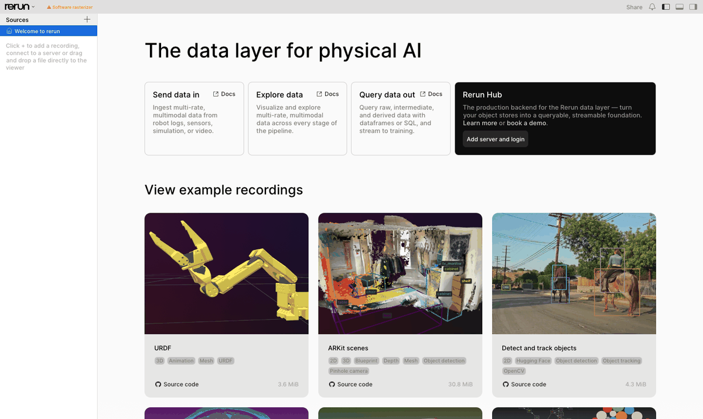
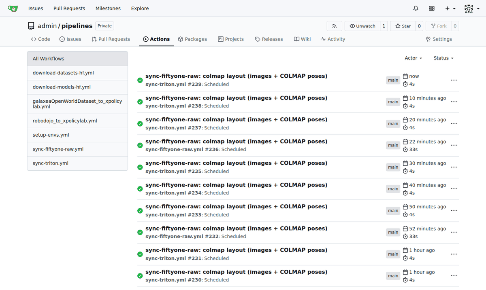
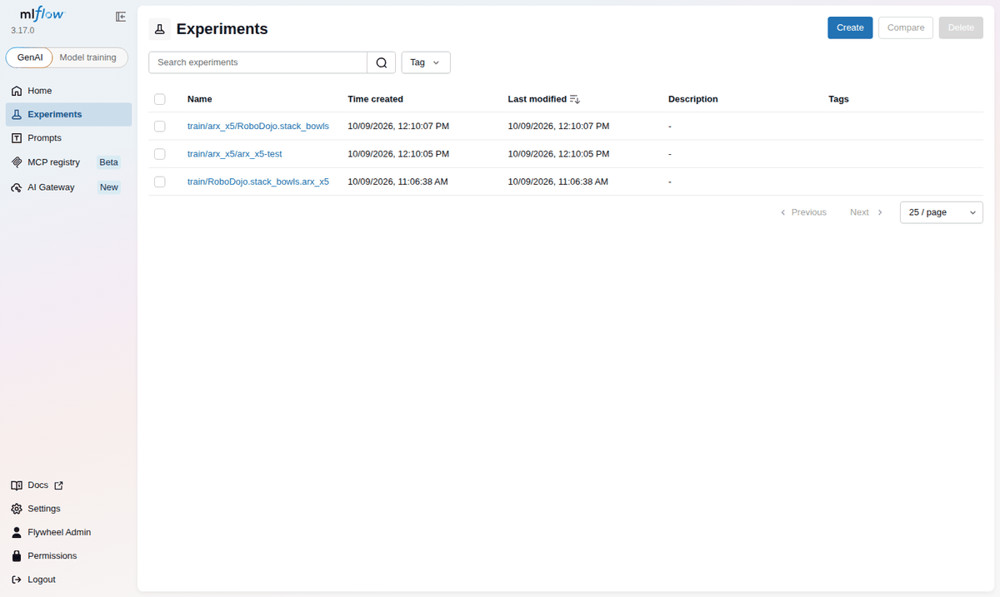
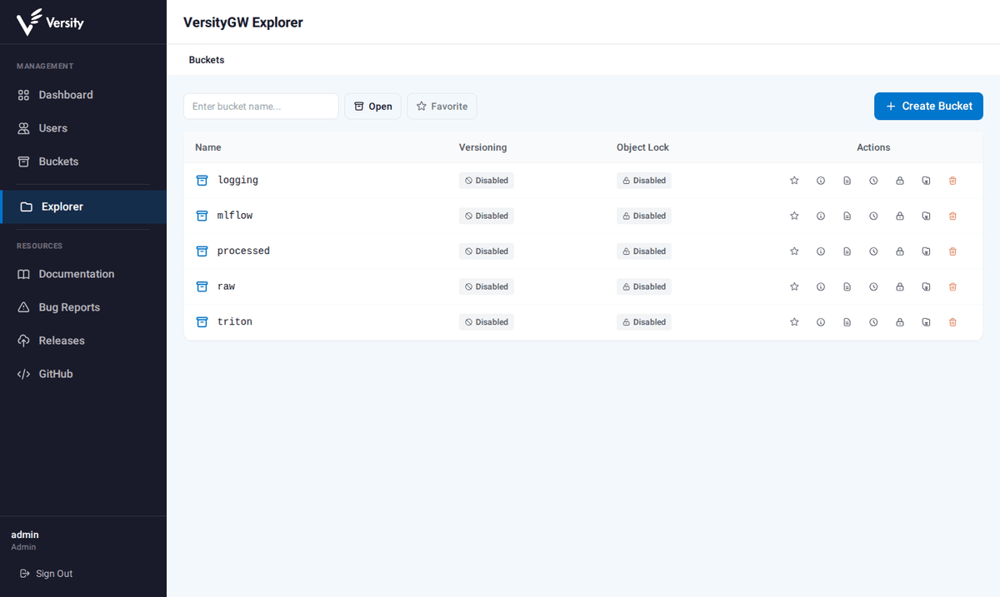
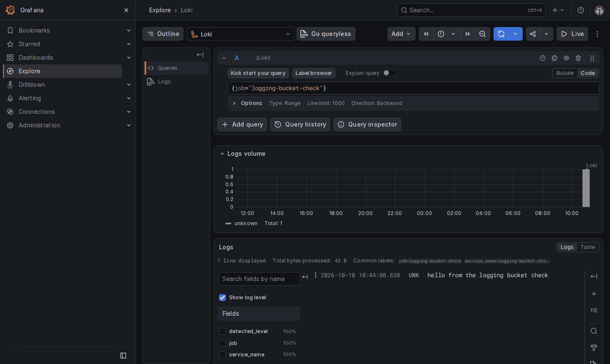

# Quickstart

For people who use the stack: browse data, upload captures, train, and read results. Running the stack itself is in [services/](services/README.md).

Ask an admin for an account first. `services/ctl.sh user add <name> <email>` gives you a Keycloak password, an MLflow access token and an S3 key pair, each shown once; keep them.

## 1. Export the environment

Run this in your shell (add it to `~/.bashrc` or `~/.zshrc` to keep it). The host settings come from [`services/.env.example`](services/.env.example) in your clone of this repo; replace the `<...>` values with what the admin gave you.

```bash
eval "$(grep -E '^(SERVICE_NODE|SERVICE_HOST|CADDY_PORT)=' services/.env.example | sed 's/^/export /')"
export FLYWHEEL_CA=~/.flywheel/ca.crt

# S3 (aws CLI, boto3)
export AWS_ACCESS_KEY_ID=<your name> AWS_SECRET_ACCESS_KEY=<your S3 secret> AWS_DEFAULT_REGION=us-east-1
export AWS_ENDPOINT_URL=https://s3.$SERVICE_HOST:$CADDY_PORT AWS_CA_BUNDLE=$FLYWHEEL_CA

# MLflow (Python client)
export MLFLOW_TRACKING_URI=https://$SERVICE_HOST:$CADDY_PORT/mlflow
export MLFLOW_TRACKING_USERNAME=<your name> MLFLOW_TRACKING_PASSWORD=<your MLflow token>
export MLFLOW_TRACKING_SERVER_CERT_PATH=$FLYWHEEL_CA

# Triton (only if you call served models; the token comes from the admin)
export TRITON_URL=triton.$SERVICE_HOST:$CADDY_PORT TRITON_TOKEN=<Triton token>
```

On the cluster's own nodes you can instead load all of this from the admin's `slurm.env` ([slurm/](services/slurm/README.md)).

## 2. Set up SSH (from a laptop)

The stack listens on one HTTPS port on `SERVICE_NODE`, reachable through a login node. Skip this section on the cluster itself.

1. Add a host to `~/.ssh/config` that forwards the port (fill in the login node, your user and the values from step 1):
   ```
   Host flywheel
     HostName <login-node>
     User <your cluster user>
     LocalForward 8443 <SERVICE_NODE>:8443
   ```
2. Point the stack's names at the tunnel (once):
   ```bash
   echo "127.0.0.1 $SERVICE_HOST fiftyone.$SERVICE_HOST rerun.$SERVICE_HOST s3.$SERVICE_HOST triton.$SERVICE_HOST" | sudo tee -a /etc/hosts
   ```
3. Open the tunnel whenever you use the stack:
   ```bash
   ssh -N flywheel
   ```

## 3. Trust the stack's certificate

```bash
mkdir -p ~/.flywheel && curl -k https://$SERVICE_HOST:$CADDY_PORT/ca.crt -o $FLYWHEEL_CA
```

For your browser, add it to the system trust store: [Access](services/README.md#access).

## 4. Use the services

Open `https://$SERVICE_HOST:$CADDY_PORT/` for links to everything.



### Sign in (Keycloak)

The first web page you open asks you to sign in. Use your name and the Keycloak password; one sign-in covers every web app. Details: [keycloak/](services/keycloak/README.md).



### Browse data (FiftyOne)

Open `https://fiftyone.$SERVICE_HOST:$CADDY_PORT/` in Chrome (Safari can't play bags), and pick a dataset from the selector at the top left. Every folder under `raw/` appears as a dataset within 30 minutes of upload. Details: [fiftyone/](services/fiftyone/README.md).



### Inspect recordings and bags (Rerun)

Click a sample's `rerun_url` in FiftyOne, or open `https://rerun.$SERVICE_HOST:$CADDY_PORT/` and add a recording. Details: [rerun/](services/rerun/README.md).



### Run pipelines (Gitea Actions)

Open `https://$SERVICE_HOST:$CADDY_PORT/gitea/admin/pipelines/actions`, pick a workflow on the left and click **Run workflow** (for example `download-datasets-hf` to fetch a Hugging Face dataset). Details: [gitea/](services/gitea/README.md#run-a-workflow).



### Track experiments and models (MLflow)

Open `https://$SERVICE_HOST:$CADDY_PORT/mlflow/` and click **Sign in with Keycloak**. Experiments are named `train/<embodiment>/<mix>`; trained checkpoints are under **Models**. From Python, the variables from step 1 are enough:

```python
import mlflow
print([e.name for e in mlflow.search_experiments()])
```

Details: [mlflow/](services/mlflow/README.md), naming: [slurm/](services/slurm/README.md#naming-in-mlflow).



### Store and fetch data (S3)

The buckets: `raw` (collected data as it arrived), `processed` (converted datasets, splats, recordings) and admin-only ones ([versitygw/](services/versitygw/README.md)). **Depending on your user, you may not see every bucket, or see none in a list**: your key may only read some buckets, or only upload into one folder. Open the ones you were given by name.

In the browser:

1. Open `https://s3.$SERVICE_HOST:$CADDY_PORT/ui/` and sign in with your S3 access key and secret.
2. Go to **Explorer**. If your bucket isn't listed, type its name (e.g. `raw`) into **Enter bucket name** and click **Open**.



From the shell, with the variables from step 1:

1. Install the AWS CLI (or run it without installing: `uvx --from awscli aws ...`).
   ```bash
   uv tool install awscli
   ```
2. List a bucket you have access to.
   ```bash
   aws s3 ls s3://raw/
   ```
3. Upload a collection into `raw`.
   ```bash
   aws s3 sync ./my_capture s3://raw/internal_datasets/<dataset>/
   ```

For a named profile instead of environment variables, see [Client setup](services/versitygw/README.md#client-setup).

### Search logs (Grafana and Loki)

Open `https://$SERVICE_HOST:$CADDY_PORT/grafana/`, sign in with Keycloak, go to **Explore**, pick **Loki** and query by label, e.g. `{job="<job>"}`. To send logs from a robot or laptop, see [loki/](services/loki/README.md).



### Call a served model (Triton)

Check that Triton answers and list what it serves:

```bash
curl --cacert $FLYWHEEL_CA -H "Authorization: Bearer $TRITON_TOKEN" -X POST https://$TRITON_URL/v2/repository/index
```

To serve a model and call it from Python, see [triton/](services/triton/README.md).

### Train and evaluate (Slurm)

Training and evaluation are Slurm jobs submitted from a login node: [slurm/](services/slurm/README.md).
